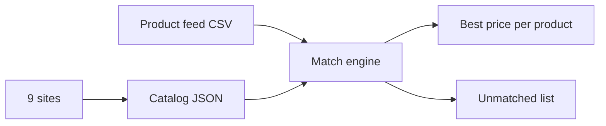

# 9-Site Creatine Competitor Price Scraper

Finds the best competitor price for each creatine product across 9 UK supplement sites.
Works.

No proxy needed. No API key needed. Direct HTTP + free Jina Reader fallback.

## How it works



## Sites & methods

| # | Site | Method |
|---|------|--------|
| 1 | ActiveSportsNutrition | Search pages `Search?q=Creatine&size=100&skip=0..300`. Split tiles on `product-list-item-title`, name from `productDetailLink`, price from `finalPrice.amountIncVat` JSON |
| 2 | DolphinFitness | List pages `/en/creatine/list/1..9`. Split on `ari-pc pg-pc` cells, name from link `title`, price = lowest `£` in cell |
| 3 | HollandAndBarrett | Via Jina Reader (direct returns a 202 challenge page). Parse markdown product links, name + `£` from link label |
| 4 | AppliedNutrition | Shopify `/products.json` (paginated, 250/page). Title + variant title, variant price + barcode |
| 5 | 10xAthletic | Shopify `/products.json` (paginated, 250/page). Title + variant title, variant price + barcode |
| 6 | AnimalPak | Shopify `/products.json` (paginated, 250/page). Title + variant title, variant price + barcode |
| 7 | CellucorUk | Homepage `/product/*` links, visit each page. Price from JSON-LD (`price` + `priceCurrency: GBP`, or `lowPrice`, or `£`), name from `<title>`, barcode from `gtin13` |
| 8 | IHerbUk | Search pages `search?kw=creatine&p=1..20`. Split on `data-product-id`, price from `discountPrice` / `data-ga-discount-price`, name from `itemprop="name"` (Jina fallback if blocked) |
| 9 | ReflexNutrition | Shopify `/products.json` (paginated, 250/page). Title + variant title, variant price + barcode |

Plus `catalog_brands.py`: full per-brand catalogs for Dolphin (`/en/{brand-slug}/list/`) and ASN (`Search?q={Brand}`) so non-creatine lines (gainers, pre-workouts) are covered too.

## Files (run in order)

| # | File | Does |
|---|------|------|
| 1 | `competitor9.py` | Scrapes all 9 sites → `comp_cache/catalog9.json` |
| 2 | `catalog_brands.py` | Full brand catalogs (Dolphin + ASN) → `comp_cache/catalog_brands.json` |
| 3 | `competitor9_engine.py` | **Main engine** — matches feed rows vs catalogs → final CSV + debug + unmatched report |
| 4 | `apply_whitelist.py` | Backfills hand-verified lines (fill-only, never overwrites) |
| 5 | `diffreport.py` | Human-readable audit of unmatched rows |
| 6 | `regtest.py` | Regression tests (exit 0 = pass) |
| 7 | `competitor_catalog.py` | Older engine (archive) |
| 8 | `price_engine.py` | Older engine v2 (archive) |

## Usage

```bash
pip install "scrapling[fetchers]"

# Put your product feed CSV next to the scripts (utf-8-sig)

python3.11 competitor9.py         # scrape 9 sites
python3.11 catalog_brands.py     # full Dolphin + ASN brand catalogs
python3.11 competitor9_engine.py  # match → final CSV + debug + unmatched
python3.11 apply_whitelist.py    # optional whitelist backfill
python3.11 diffreport.py         # audit leftovers
python3.11 regtest.py            # regression check
```

## Notes

- Read the feed CSV with `encoding="utf-8-sig"` (BOM).
- Matching: barcode-exact first, then brand + name + size fuzzy (size is a hard block — 187g never matches 500g).
- Best-price tie-break: most-common competitor (catalog coverage).
- Engine output = original columns + `competitor` + `competitorPrice` (USD).
- If a product has no match, it means that product is sold on only 1 site (no competitor carries it) — not a scraper failure. Uncertain rows stay empty and go to the unmatched report, never guessed.
