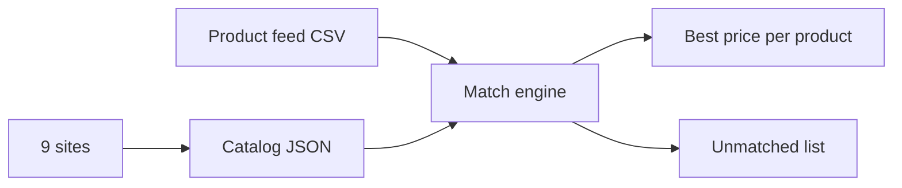

# 9-Site Creatine Competitor Price Scraper

Finds the best competitor price for each creatine product across 9 UK supplement sites.
Works.

No proxy needed. No API key needed. Direct HTTP + free Jina Reader fallback.

## How it works



## Sites

| # | Site | Method |
|---|------|--------|
| 1 | ActiveSportsNutrition | direct |
| 2 | DolphinFitness | direct |
| 3 | HollandAndBarrett | via Jina Reader (direct returns a 202 challenge page) |
| 4 | AppliedNutrition | Shopify `products.json` |
| 5 | 10xAthletic | direct |
| 6 | AnimalPak | direct |
| 7 | CellucorUk | direct |
| 8 | IHerbUk | direct (+ Jina fallback) |
| 9 | ReflexNutrition | Shopify `products.json` |

## Files (run in order)

| # | File | Does |
|---|------|------|
| 1 | `competitor9.py` | Scrapes all 9 sites → `comp_cache/catalog9.json` |
| 2 | `catalog_brands.py` | Full brand catalogs (Dolphin + ASN) → `comp_cache/catalog_brands.json` |
| 3 | `competitor9_engine.py` | **Main engine** — matches feed rows vs catalogs → final CSV + debug + unmatched report |
| 4 | `apply_whitelist.py` | Backfills hand-verified lines (fill-only, never overwrites) |
| 5 | `diffreport.py` | Human-readable audit of unmatched rows |
| 6 | `regtest.py` | Regression tests (exit 0 = pass) |
| 7 | `competitor_catalog.py` | Older engine (archive) |
| 8 | `price_engine.py` | Older engine v2 (archive) |

## Usage

```bash
pip install "scrapling[fetchers]"

# Put your product feed CSV next to the scripts (utf-8-sig)

python3.11 competitor9.py         # scrape 9 sites
python3.11 catalog_brands.py     # full Dolphin + ASN brand catalogs
python3.11 competitor9_engine.py  # match → final CSV + debug + unmatched
python3.11 apply_whitelist.py    # optional whitelist backfill
python3.11 diffreport.py         # audit leftovers
python3.11 regtest.py            # regression check
```

## Notes

- Read the feed CSV with `encoding="utf-8-sig"` (BOM).
- Matching: barcode-exact first, then brand + name + size fuzzy (size is a hard block — 187g never matches 500g).
- Best-price tie-break: most-common competitor (catalog coverage).
- Engine output = original columns + `competitor` + `competitorPrice` (USD).
- If a product has no match, it means that product is sold on only 1 site (no competitor carries it) — not a scraper failure. Uncertain rows stay empty and go to the unmatched report, never guessed.
